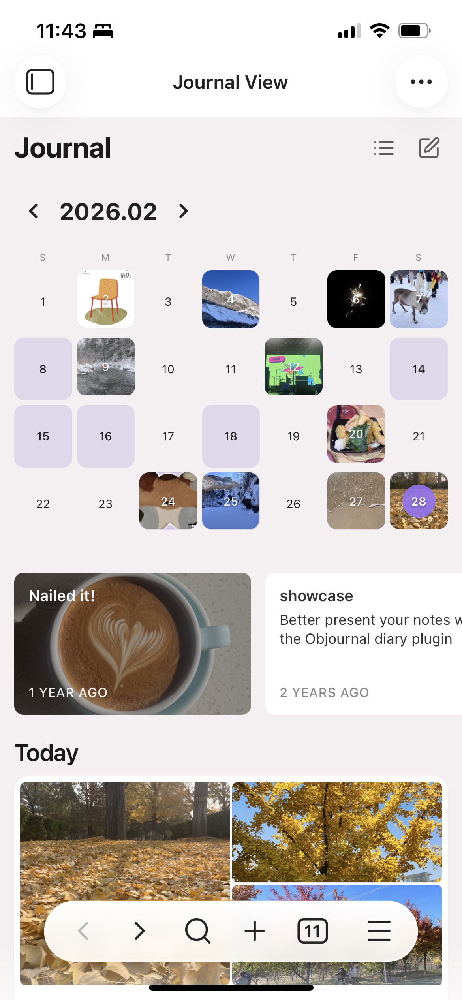
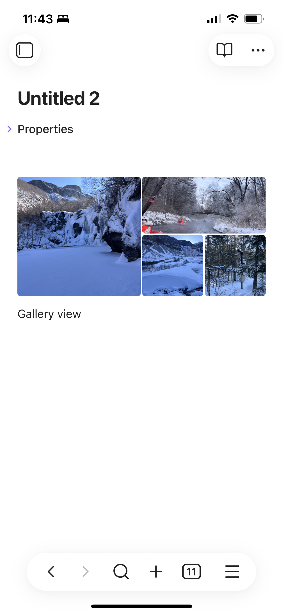

# 手记视图 (Journal View)

**Read in your language:** [English](README.md) · [简体中文](README-zh_cn.md) · [日本語](README-ja.md) · [繁體中文](README-zh_tw.md)

---


| 列表视图 | 月历视图 | 编辑页画廊 |
|:--------:|:--------:|:----------:|
|  |  |  |

将 Markdown 文件按日历组织，生成类似手记应用的视图。月历、列表、那年今日、手记式图片布局，一站式呈现你的日记与笔记。

如果手记视图对你有帮助，欢迎通过以下方式支持我：

- [Ko-fi 请我喝杯咖啡](https://ko-fi.com/jacelin) ☕️
- 微信赞赏：

---

## 1 功能特性

### 1.1 首页视图

- **月历视图**：按月份展示手记，日期格内显示缩略图，点击日期查看当天条目
- **列表视图**：时间线式列表，按日期分组（今天、昨天、往年）
- **那年今日**：展示往年同月同日的所有手记，横向卡片布局
- **手记卡片**：标题、日期、正文摘要、图片（支持 1~5+ 张多种布局）
- **统计栏**（可选）：连续纪录天数、总字数、写手记天数

### 1.2 编辑页

- **手记式图片布局**：默认文件夹内的笔记，在 Live Preview 模式下，图片按首页卡片样式排列（1/2/3/4/5+ 张多种布局）
- **超 5 张自动拆分**：同一段连续图片超过 5 张时，自动拆成多个画廊，保证每张图都可见
- **实时更新**：添加/删除图片时自动重新渲染
- **图片删除**：每张图支持右上角删除按钮

### 1.3 其他

- **多语言**：简体中文、English、日本語、繁體中文
- **虚拟化列表**：基于 @tanstack/react-virtual，长列表性能优化
- **文件系统监听**：新建、修改、删除、重命名时自动刷新
- **可配置日期字段**：支持 frontmatter 中 `date`、`Date`、`created`、`created_time` 等，或自定义字段

---

## 2 安装

### 使用 BRAT（推荐）

1. 安装 [BRAT](https://github.com/TfTHacker/obsidian42-brat) 插件
2. 在 BRAT 设置中点击「Add Beta plugin」
3. 填入本插件的 GitHub 仓库 URL
4. 安装并在 Obsidian 中启用

> **Tip**：BRAT 会自动检查更新并提醒新版本。

### 手动安装

1. 从 [Releases](https://github.com/你的用户名/obsidian-journal-react/releases) 下载 `main.js`、`manifest.json`、`styles.css`
2. 放入 `{vault}/.obsidian/plugins/obsidian-journal-react/`
3. 在 Obsidian 中启用插件

### 自行构建

```bash
cd .obsidian/plugins/obsidian-journal-react
npm install
npm run build
```

构建产物会输出到插件目录。

---

## 3 使用

### 打开视图

- **命令**：`Ctrl/Cmd + P` → 输入「打开手记视图」→ 回车
- 或通过命令面板执行「打开手记视图」

### 新建笔记

- 在视图右上角点击 **+** 按钮
- 使用配置的默认模板创建当日笔记

### 切换视图模式

- 点击月历/列表图标，在月历视图与列表视图间切换

---

## 4 设置

| 设置项 | 说明 |
|--------|------|
| **默认文件夹** | 手记视图默认打开该文件夹，编辑页图片布局仅在此文件夹内的笔记生效 |
| **日期字段** | 指定 frontmatter 中的日期字段，如 `date`、`created`；若无则使用文件创建时间 |
| **默认模板** | 新建笔记时使用的模板，支持 `{{date}}`、`{{year}}`、`{{month}}`、`{{day}}`、`{{title}}` |
| **编辑页手记式图片布局** | 在 Live Preview 中，默认文件夹内笔记是否启用图片布局 |
| **图片间距** | 图片容器之间的间距（0–30px） |
| **图片显示限制** | 每个卡片最多显示的图片数量（默认 3，首页实际以 5 张布局展示） |
| **打开笔记方式** | 新标签页 / 当前标签页 |
| **显示统计栏** | 是否在顶部展示连续天数、字数等统计 |
| **IndexedDB 存储占用** | 在维护区域查看条目缓存与缩略图的存储占用，支持一键清除 |

---

## 5 日期与图片规则

### 5.1 日期提取

1. **优先级 1**：从 frontmatter 读取日期（支持自定义字段或默认 `date`、`Date`、`created`、`created_time`）
2. **优先级 2**：使用文件创建时间 `ctime`

### 5.2 图片布局

**首页卡片**

| 图片数量 | 布局 |
|----------|------|
| 1 张 | 单列 2:1 |
| 2 张 | 左右各 2:1 |
| 3 张 | 左大 + 右 2 小 |
| 4 张 | 左大 + 右 3 小 |
| 5+ 张 | 左大 + 右 4 小，超出拆成多个画廊 |

**编辑页**：与首页布局一致，超过 5 张连续图片自动拆成多个画廊，每张图支持右上角删除。

### 5.3 缩略图缓存

首页卡片中的图片会生成 WebP 缩略图，以加快滚动与加载。

**何时生成？**

| 你的操作 | 系统行为 |
|----------|----------|
| 打开手记视图 | 只读已有缓存，不生成 |
| 滚动看到某张图 | 有缓存则直接显示；没有则先显示原图，后台生成后自动切换为缩略图 |
| 新建笔记后返回 | 新笔记的图片在列表中显示时，会按需生成并缓存 |
| 修改了某张图片 | 视为新图，下次查看时重新生成 |
| 长时间不用某些图 | 超出配额时，自动淘汰最近最少使用的缩略图 |
| 清除缓存 | 清空所有缩略图，下次查看时重新生成 |

**存储配额与淘汰**

- **IndexedDB**：缩略图总容量上限约 200 MB，超出时按「最近最少使用」自动淘汰
- **内存**：最多缓存 200 张，同样采用 LRU 淘汰
- 在「设置 → 维护」中可查看当前占用并手动清除

---

## 6 隐私与存储

- **本地存储**：插件使用 IndexedDB 缓存条目元数据与缩略图，数据仅存储在本地，不会上传
- **存储配额**：缩略图缓存上限约 200 MB，超出时自动淘汰最近最少使用的项（详见 5.3）
- **可清除**：在「设置 → 维护」中可查看存储占用并一键清除缓存
- **无网络请求**：插件不向外部服务器发送任何数据

---

## 7 开发

### 命令

```bash
# 安装依赖
npm install

# 开发模式（监听文件变化并构建）
npm run dev

# 生产构建
npm run build
```

### 技术栈

- **React 18**：UI 框架
- **@tanstack/react-virtual**：虚拟化列表
- **TypeScript**：类型安全
- **esbuild**：构建

### 项目结构

```
obsidian-journal-react/
├── src/
│   ├── main.ts                 # 插件入口
│   ├── settings.ts             # 设置类型与默认值
│   ├── settings/               # 设置 Tab
│   ├── view/                   # 视图容器
│   ├── components/             # React 组件
│   ├── context/                # React Context
│   ├── hooks/                  # 自定义 Hooks
│   ├── editor/                 # Live Preview 图片布局
│   ├── storage/                # IndexedDB 存储
│   ├── utils/                  # 工具函数
│   ├── i18n/                   # 多语言
│   └── constants.ts
├── styles.css
├── manifest.json
├── package.json
└── esbuild.config.mjs
```

---

## 8 许可证

MIT License

---

如有问题或建议，欢迎在 GitHub Issues 反馈（若已开源）。
